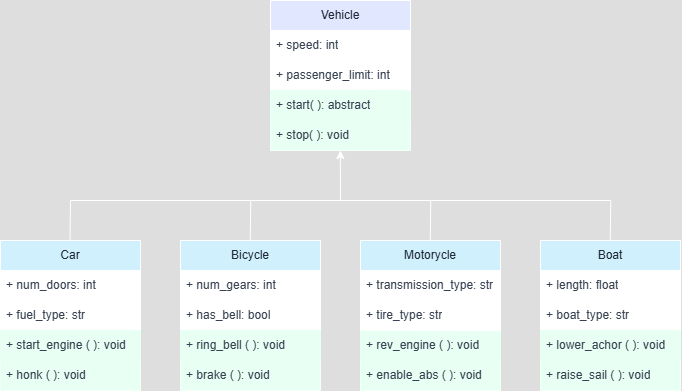

# 🚗🚲Vehicle Management System🏍️⛵

## Team Members

| Name                       | GitHub                                              |
| -------------------------- | --------------------------------------------------- |
| Castillano, Rex Anthony C. | [rexanthonyyy](https://github.com/rexanthonyyy)     |
| Fabellar, Frances Iroll M. | [airosiers](https://github.com/airosiers)           |
| Labrador, Matthew Louis G. | [Artemissssssss](https://github.com/Artemissssssss) |
| Vinluan, Philip Joshua D.  | [philip696969](https://github.com/philip696969)     |

## 📋Description

This system is an interactive program where users can enter details for different vehicles (Car, Bicycle, Motorcycle, and Boat) and use a menu to interact with them. It has a base class called `Vehicle` with common features like speed and passenger capacity. Each vehicle type (Car, Bicycle, Motorcycle, Boat) has its own actions, such as starting, honking, or raising sails. Users can input vehicle details and then choose from a menu to perform actions like starting the vehicle, stopping it, or getting more information. The system is simple and lets users easily explore and control different vehicles.



Users can input details for four vehicle types:

- Car 🚗
- Bicycle 🚴🏻
- Motorcycle 🏍️
- Boat 🚤

Each vehicle has its own unique attributes and methods. The system provides interactive menus where users can perform actions like starting the vehicle, stopping it, or displaying its information. The system also adjusts options dynamically (e.g., hiding "Ring Bell" if the bicycle has no bell).

# 🧾 Code Snippet

```python
from abc import ABC, abstractmethod

# Abstract Base Class
class Vehicle(ABC):
    def __init__(self, speed, passenger_limit):
        self.speed = speed  # in km/h
        self.passenger_limit = passenger_limit  # in persons

    @abstractmethod
    def start(self):
        pass

    def stop(self):
        print(f"{self.__class__.__name__} is stopping.")

```

## 💻⚙️💨How to Run the Program

1. Make sure you have **Python 3** installed on your system.
2. Download the file `VEHICLE.py`.
3. Open a terminal or command prompt.
4. Navigate to the directory containing the file.
5. Run the program using:
   ```bash
   python VEHICLE.py
   ```

## 🎖️Acknowledgment

We, Team 1, would like to express our sincere gratitude to everyone who supported us throughout the development of this project. We thank our instructor for their guidance and valuable feedback, which helped us improve our work. We also appreciate the teamwork and dedication of each team member, whose efforts made this project possible. Lastly, we are thankful for the opportunity to learn and apply our skills through this experience.
